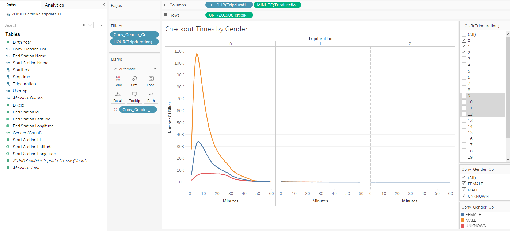

# Bikesharing

## Overview
    Task involved is to convince investors that a bike-sharing program in Des Moines is a strong business proposal. In order to 
achieve this task, stakeholders would like to review bike trip analysis. Activities involved for this analysis are as follows:

Deliverable 1: Change Trip Duration to a Datetime Format
Deliverable 2: Create Visualizations for the Trip Analysis
Deliverable 3: Create a Story and Report for the Final Presentation

## Results

Deliverable 1: Change Trip Duration to a Datetime Format

Deliverable 2: Create Visualizations for the Trip Analysis

 

Based on information projected. maximum usage of bikes seems to occur within first twenty minutes. This also means there could be high demand of bikes during this timeframe.

[link to worksheet](https://public.tableau.com/app/profile/aparna.nair5865/viz/CheckoutTimesForUsers/CheckoutTimesforUsers)

 

Usage of bikes within twenty minutes seems to be consumed more by male users.

[link to worksheet](https://public.tableau.com/app/profile/aparna.nair5865/viz/CheckoutTimesByGender_16423148227630/CheckoutTimesbyGender)

 

Looks like trend during weekdays is that users use bike services for commuting purposes. In addition looks like after work also there was usage .
 
[link to worksheet](https://public.tableau.com/app/profile/aparna.nair5865/viz/TripsByWeekdayForEachHour/TripsbyWeekdayforEachHour)

.PNG) 

Majority of users of bike services are Male users.

[link to worksheet](https://public.tableau.com/app/profile/aparna.nair5865/viz/TripsbyGenderWeekdayperHour_16423169964910/TripsbyGenderWeekdayperHour_1)

 

Male subscribers seem to be using bike services for commuting and non subscribers use it more during the weekend.

[link to worksheet](https://public.tableau.com/app/profile/aparna.nair5865/viz/UserTripsbyGenderbyWeekday_16423176004370/UserTripsbyGenderbyWeekday_1)

Deliverable 3: Create a Story and Report for the Final Presentation

Link to Tableau Story:

[link to dashboard](https://public.tableau.com/app/profile/aparna.nair5865/viz/NYCCitibikeanalysis_16423889545680/NYCCitibikeanalysis?publish=yes)

## Summary
 To summarize, bike sharing services are very popular in busy metropolitan areas and maximum user types are subscribers and Male
gender population. In addition looks like morning and evening commute timings are the main usage timezones.
 In addition to analysis that was done, following 2 drill downs would add additional value in making decisions:
 1-Average trip duration--To add in average trip duration by gender and birth year in other to get an insight if they is a difference as they age
 2-Maximum traffic flow at stations by timings of Morning versus evening
 